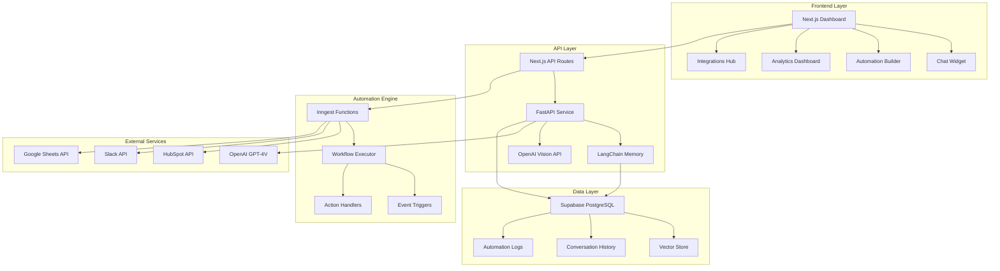

# Design Document: Advanced Automation Platform

## Overview

This design transforms the existing EchoAI SaaS from a basic Q&A chatbot into a comprehensive automation platform. The architecture maintains the current Next.js frontend and FastAPI backend while adding sophisticated conversation memory, visual workflow automation, multi-modal AI capabilities, and extensive third-party integrations.

The system follows a microservices-oriented approach with clear separation of concerns:
- **Frontend**: Enhanced Next.js dashboard with React Flow automation builder
- **Backend**: Extended FastAPI service with LangChain memory management
- **Automation Engine**: Inngest-powered durable function execution
- **Integration Layer**: OAuth-secured connections to external services
- **Analytics**: Real-time Supabase subscriptions for live metrics

## Architecture

### High-Level System Architecture



### Enhanced Database Schema

The existing schema will be extended with new tables for conversation management, automation workflows, and integrations:

```sql
-- New tables for advanced features

-- Enhanced conversation tracking with external user identification
CREATE TABLE "ExternalUser" (
    id TEXT PRIMARY KEY DEFAULT gen_random_uuid()::text,
    email TEXT UNIQUE NOT NULL,
    "firstName" TEXT,
    "lastName" TEXT,
    "createdAt" TIMESTAMP WITH TIME ZONE DEFAULT NOW(),
    "updatedAt" TIMESTAMP WITH TIME ZONE DEFAULT NOW()
);

-- Conversation sessions with memory management
CREATE TABLE "ConversationSession" (
    id TEXT PRIMARY KEY DEFAULT gen_random_uuid()::text,
    "externalUserId" TEXT NOT NULL REFERENCES "ExternalUser"(id) ON DELETE CASCADE,
    "chatbotId" TEXT NOT NULL REFERENCES "Chatbot"(id) ON DELETE CASCADE,
    "memoryBuffer" JSONB, -- LangChain memory state
    "isActive" BOOLEAN DEFAULT true,
    "createdAt" TIMESTAMP WITH TIME ZONE DEFAULT NOW(),
    "updatedAt" TIMESTAMP WITH TIME ZONE DEFAULT NOW()
);

-- Enhanced message tracking with sentiment and metadata
ALTER TABLE "Message" ADD COLUMN "sessionId" TEXT REFERENCES "ConversationSession"(id) ON DELETE CASCADE;
ALTER TABLE "Message" ADD COLUMN "sentimentScore" DECIMAL(3,2); -- -1.00 to 1.00
ALTER TABLE "Message" ADD COLUMN "metadata" JSONB;
ALTER TABLE "Message" ADD COLUMN "imageUrl" TEXT;

-- Automation workflows
CREATE TABLE "AutomationWorkflow" (
    id TEXT PRIMARY KEY DEFAULT gen_random_uuid()::text,
    "userId" UUID NOT NULL REFERENCES "User"(id) ON DELETE CASCADE,
    name TEXT NOT NULL,
    description TEXT,
    "flowDefinition" JSONB NOT NULL, -- React Flow graph
    "stateMachine" JSONB NOT NULL, -- XState machine definition
    "isActive" BOOLEAN DEFAULT true,
    "createdAt" TIMESTAMP WITH TIME ZONE DEFAULT NOW(),
    "updatedAt" TIMESTAMP WITH TIME ZONE DEFAULT NOW()
);

-- Workflow execution logs
CREATE TABLE "WorkflowExecution" (
    id TEXT PRIMARY KEY DEFAULT gen_random_uuid()::text,
    "workflowId" TEXT NOT NULL REFERENCES "AutomationWorkflow"(id) ON DELETE CASCADE,
    "triggerId" TEXT NOT NULL,
    "triggerData" JSONB,
    status TEXT NOT NULL CHECK (status IN ('pending', 'running', 'completed', 'failed')),
    "executionLog" JSONB,
    "startedAt" TIMESTAMP WITH TIME ZONE DEFAULT NOW(),
    "completedAt" TIMESTAMP WITH TIME ZONE
);

-- Third-party integrations
CREATE TABLE "Integration" (
    id TEXT PRIMARY KEY DEFAULT gen_random_uuid()::text,
    "userId" UUID NOT NULL REFERENCES "User"(id) ON DELETE CASCADE,
    provider TEXT NOT NULL, -- 'hubspot', 'slack', 'google_sheets'
    "accessToken" TEXT NOT NULL, -- Encrypted
    "refreshToken" TEXT, -- Encrypted
    "tokenExpiry" TIMESTAMP WITH TIME ZONE,
    config JSONB, -- Provider-specific configuration
    "isActive" BOOLEAN DEFAULT true,
    "createdAt" TIMESTAMP WITH TIME ZONE DEFAULT NOW(),
    "updatedAt" TIMESTAMP WITH TIME ZONE DEFAULT NOW()
);

-- FAQ management
CREATE TABLE "FAQ" (
    id TEXT PRIMARY KEY DEFAULT gen_random_uuid()::text,
    "chatbotId" TEXT NOT NULL REFERENCES "Chatbot"(id) ON DELETE CASCADE,
    question TEXT NOT NULL,
    answer TEXT NOT NULL,
    category TEXT,
    "displayOrder" INTEGER DEFAULT 0,
    "isActive" BOOLEAN DEFAULT true,
    "createdAt" TIMESTAMP WITH TIME ZONE DEFAULT NOW()
);

-- Image analysis results
CREATE TABLE "ImageAnalysis" (
    id TEXT PRIMARY KEY DEFAULT gen_random_uuid()::text,
    "messageId" TEXT NOT NULL REFERENCES "Message"(id) ON DELETE CASCADE,
    "imageUrl" TEXT NOT NULL,
    prompt TEXT NOT NULL,
    "analysisResult" JSONB NOT NULL,
    "processingTime" INTEGER, -- milliseconds
    "createdAt" TIMESTAMP WITH TIME ZONE DEFAULT NOW()
);
```

## Components and Interfaces

### 1. Enhanced Chat Widget Component

**Location**: `echoai-saas/src/components/ChatWidget.tsx`

**Key Features**:
- Tabbed interface (Chat, FAQ, History)
- Image upload capability
- User email identification
- Session persistence

**Props Interface**:
```typescript
interface ChatWidgetProps {
  chatbotId: string;
  userEmail?: string;
  primaryColor?: string;
  welcomeMessage?: string;
  enableImageUpload?: boolean;
  enableFAQ?: boolean;
  enableHistory?: boolean;
}
```

**Dependencies**:
- `@radix-ui/react-tabs` (already installed)
- `react-dropzone` (new dependency)
- Custom hooks for session management

### 2. Automation Workflow Builder

**Location**: `echoai-saas/src/components/AutomationBuilder.tsx`

**Key Features**:
- Visual node-based editor using React Flow
- Drag-and-drop trigger and action nodes
- Real-time workflow validation
- XState machine generation

**Dependencies**:
```json
{
  "reactflow": "^11.10.0",
  "@xstate/react": "^4.1.0",
  "xstate": "^5.0.0"
}
```

**Node Types**:
- **Trigger Nodes**: New Conversation, Intent Detected, Sentiment Analysis, Image Upload
- **Action Nodes**: Send Message, Create Contact, Tag Conversation, Send Notification
- **Condition Nodes**: If/Then logic, Data validation, Threshold checks

### 3. Memory-Enhanced Chat API

**Location**: `fastapi-service/app/api/chat.py`

**Enhanced Endpoint**:
```python
@router.post("/chat")
async def enhanced_chat(
    request: EnhancedChatRequest,
    db: Session = Depends(get_db)
):
    # 1. Retrieve or create conversation session
    # 2. Load conversation memory using LangChain
    # 3. Process message with RAG + memory context
    # 4. Analyze sentiment
    # 5. Trigger automation workflows
    # 6. Update memory buffer
    # 7. Return response with session info
```

**New Dependencies**:
```txt
langchain-memory>=0.1.0
inngest>=0.3.0
openai>=1.0.0
textblob>=0.17.0  # For sentiment analysis
```

### 4. Vision Analysis Service

**Location**: `fastapi-service/app/services/vision_service.py`

**Key Methods**:
```python
class VisionService:
    async def analyze_image(
        self, 
        image_url: str, 
        prompt_type: str,
        custom_prompt: Optional[str] = None
    ) -> Dict[str, Any]:
        # Process image with GPT-4-Vision
        # Return structured analysis results
        
    async def analyze_product_condition(self, image_url: str) -> ProductCondition:
        # Specific analysis for product returns
        
    async def extract_invoice_data(self, image_url: str) -> InvoiceData:
        # Extract structured data from invoices
```

### 5. Integration Management System

**Location**: `echoai-saas/src/components/IntegrationsHub.tsx`

**OAuth Flow Implementation**:
```typescript
interface IntegrationProvider {
  id: string;
  name: string;
  description: string;
  authUrl: string;
  scopes: string[];
  configSchema: JSONSchema;
}

class IntegrationManager {
  async initiateOAuth(provider: string): Promise<string>;
  async handleCallback(code: string, state: string): Promise<Integration>;
  async refreshToken(integrationId: string): Promise<void>;
  async testConnection(integrationId: string): Promise<boolean>;
}
```

### 6. Real-Time Analytics Dashboard

**Location**: `echoai-saas/src/components/AnalyticsDashboard.tsx`

**Real-time Subscriptions**:
```typescript
const useRealtimeAnalytics = () => {
  const [metrics, setMetrics] = useState<AnalyticsMetrics>();
  
  useEffect(() => {
    const subscription = supabase
      .channel('analytics')
      .on('postgres_changes', 
        { event: '*', schema: 'public', table: 'Message' },
        handleMessageChange
      )
      .on('postgres_changes',
        { event: '*', schema: 'public', table: 'WorkflowExecution' },
        handleWorkflowChange
      )
      .subscribe();
      
    return () => subscription.unsubscribe();
  }, []);
};
```

## Data Models

### Core Data Structures

```typescript
// Enhanced conversation management
interface ConversationSession {
  id: string;
  externalUserId: string;
  chatbotId: string;
  memoryBuffer: LangChainMemoryState;
  isActive: boolean;
  createdAt: Date;
  updatedAt: Date;
}

interface EnhancedMessage {
  id: string;
  sessionId: string;
  content: string;
  role: 'user' | 'assistant';
  sentimentScore?: number;
  metadata?: Record<string, any>;
  imageUrl?: string;
  createdAt: Date;
}

// Automation workflow structures
interface WorkflowNode {
  id: string;
  type: 'trigger' | 'action' | 'condition';
  data: {
    label: string;
    config: Record<string, any>;
  };
  position: { x: number; y: number };
}

interface AutomationWorkflow {
  id: string;
  userId: string;
  name: string;
  description?: string;
  flowDefinition: {
    nodes: WorkflowNode[];
    edges: WorkflowEdge[];
  };
  stateMachine: XStateDefinition;
  isActive: boolean;
}

// Integration models
interface Integration {
  id: string;
  userId: string;
  provider: 'hubspot' | 'slack' | 'google_sheets' | 'salesforce';
  accessToken: string; // Encrypted
  refreshToken?: string; // Encrypted
  tokenExpiry?: Date;
  config: ProviderConfig;
  isActive: boolean;
}

// Vision analysis results
interface ImageAnalysisResult {
  id: string;
  messageId: string;
  imageUrl: string;
  prompt: string;
  analysisResult: {
    confidence: number;
    extractedData: Record<string, any>;
    recommendations?: string[];
  };
  processingTime: number;
}
```

### LangChain Memory Integration

```python
# Memory management for conversation context
from langchain.memory import ConversationBufferWindowMemory
from langchain.schema import BaseMessage

class ConversationMemoryManager:
    def __init__(self, session_id: str, k: int = 10):
        self.session_id = session_id
        self.memory = ConversationBufferWindowMemory(
            k=k,
            return_messages=True,
            memory_key="chat_history"
        )
    
    async def load_memory(self) -> List[BaseMessage]:
        # Load from database and populate memory
        
    async def save_memory(self, human_message: str, ai_message: str):
        # Update memory and persist to database
        
    def get_context_for_llm(self) -> str:
        # Format memory for LLM consumption
```

## Error Handling

### Comprehensive Error Management Strategy

1. **API Error Handling**:
   - Graceful degradation for external service failures
   - Retry mechanisms with exponential backoff
   - Circuit breaker pattern for unstable services

2. **Automation Workflow Errors**:
   - Workflow execution error logging
   - Automatic retry with configurable policies
   - Dead letter queue for failed executions
   - User notification for critical failures

3. **Integration Failures**:
   - Token refresh automation
   - Connection health monitoring
   - Fallback mechanisms for offline integrations

4. **Memory Management Errors**:
   - Conversation state recovery
   - Memory buffer overflow handling
   - Session timeout management

```typescript
// Error handling utilities
class ErrorHandler {
  static async handleWorkflowError(
    workflowId: string, 
    error: Error, 
    context: ExecutionContext
  ): Promise<void> {
    // Log error, attempt retry, notify user if needed
  }
  
  static async handleIntegrationError(
    integrationId: string, 
    error: IntegrationError
  ): Promise<void> {
    // Handle token refresh, connection issues, etc.
  }
}
```

## Testing Strategy

### Multi-Layer Testing Approach

1. **Unit Tests**:
   - Individual component testing (React components, API endpoints)
   - Memory management functions
   - Integration service methods
   - Vision analysis utilities

2. **Integration Tests**:
   - End-to-end conversation flows with memory
   - Workflow execution testing
   - Third-party API integration testing
   - Real-time analytics data flow

3. **Automation Testing**:
   - Workflow trigger simulation
   - Action execution verification
   - Error handling and retry mechanisms
   - Performance under load

4. **User Experience Testing**:
   - Chat widget functionality across different embed scenarios
   - Automation builder usability
   - Real-time dashboard responsiveness

### Test Implementation Structure

```typescript
// Example test structure
describe('Enhanced Chat System', () => {
  describe('Memory Management', () => {
    it('should maintain conversation context across sessions');
    it('should handle memory buffer overflow gracefully');
    it('should recover from memory corruption');
  });
  
  describe('Automation Workflows', () => {
    it('should execute simple trigger-action workflows');
    it('should handle complex multi-step automations');
    it('should retry failed executions');
  });
  
  describe('Integration System', () => {
    it('should successfully authenticate with OAuth providers');
    it('should refresh expired tokens automatically');
    it('should handle API rate limiting');
  });
});
```

### Performance Testing

- **Load Testing**: Simulate high conversation volumes
- **Memory Usage**: Monitor LangChain memory consumption
- **Real-time Performance**: Test Supabase subscription scalability
- **Automation Throughput**: Measure workflow execution capacity

## Security Considerations

### Data Protection and Privacy

1. **Encryption**:
   - All integration tokens encrypted at rest
   - Conversation data encryption for sensitive content
   - Image upload security and temporary storage

2. **Access Control**:
   - User-scoped data isolation
   - API key validation for chat widget access
   - Role-based permissions for automation management

3. **External Service Security**:
   - OAuth 2.0 implementation best practices
   - Secure token storage and rotation
   - API rate limiting and abuse prevention

4. **Compliance**:
   - GDPR compliance for conversation data
   - Data retention policies
   - User consent management for integrations

### Implementation Security Measures

```typescript
// Security utilities
class SecurityManager {
  static encryptToken(token: string): string;
  static decryptToken(encryptedToken: string): string;
  static validateApiKey(apiKey: string): Promise<boolean>;
  static sanitizeUserInput(input: string): string;
  static validateImageUpload(file: File): Promise<boolean>;
}
```

This design provides a comprehensive foundation for transforming EchoAI into an advanced automation platform while maintaining security, scalability, and user experience standards.