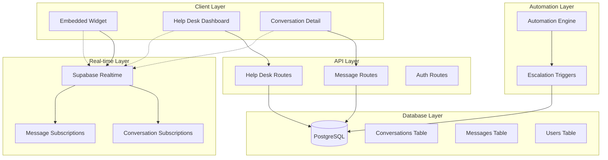

# Design Document

## Overview

The Help Desk & Human Takeover feature introduces a comprehensive human-in-the-loop system that enables business owners and support staff to monitor, manage, and directly respond to customer conversations happening through embedded AI chatbots. This system seamlessly integrates with the existing EchoAI SaaS platform, leveraging Supabase Realtime for live updates and maintaining consistency with the current shadcn/ui design system.

The feature transforms the platform from a purely AI-driven solution to a hybrid system where human agents can intervene when needed, providing personalized support while maintaining the efficiency of automated responses.

## Architecture

### High-Level Architecture



### Data Flow Architecture

1. **Customer Interaction Flow**
   - Customer sends message via embedded widget
   - Message stored in database with conversation context
   - Supabase Realtime broadcasts message to help desk dashboard
   - AI processes message (if conversation status is AI_HANDLING)
   - Human agents can monitor and intervene as needed

2. **Human Takeover Flow**
   - Agent clicks "Take Over" button
   - Conversation status changes to AWAITING_HUMAN_RESPONSE
   - Agent assignment recorded in database
   - Real-time updates notify all connected clients
   - Subsequent messages route to human agent interface

3. **Escalation Flow**
   - Automation engine detects escalation triggers
   - Conversation status automatically updated
   - Help desk dashboard receives real-time notification
   - Conversation appears in priority queue for human attention

## Components and Interfaces

### Database Schema Extensions

#### User Model Extensions
```typescript
// Add to existing User model
interface User {
  // ... existing fields
  role: 'user' | 'staff' | 'admin'  // New field with default 'user'
}
```

#### Conversation Model Extensions
```typescript
// Add to existing Conversation model
interface Conversation {
  // ... existing fields
  status: ConversationStatus
  customerEmail?: string
  source?: string
  assignedTo?: string
}

enum ConversationStatus {
  AI_HANDLING = 'AI_HANDLING',
  AWAITING_HUMAN_RESPONSE = 'AWAITING_HUMAN_RESPONSE',
  RESOLVED = 'RESOLVED'
}
```

#### Message Model Extensions
```typescript
// Extend existing Message model
interface Message {
  // ... existing fields
  role: 'user' | 'assistant' | 'agent'  // Add 'agent' role
}
```

### Frontend Components

#### 1. Help Desk Dashboard (`/helpdesk`)
```typescript
interface HelpDeskDashboard {
  // Real-time conversation table
  conversationTable: ConversationTable
  // Filtering and sorting controls
  filterControls: FilterControls
  // Real-time subscription management
  realtimeSubscription: RealtimeSubscription
}

interface ConversationTable {
  columns: [
    'id',
    'customerEmail',
    'source',
    'status',
    'sentimentScore',
    'duration',
    'lastMessage',
    'timestamp'
  ]
  realTimeUpdates: boolean
  sortable: boolean
  filterable: boolean
}
```

#### 2. Conversation Detail View (`/helpdesk/conversation/[id]`)
```typescript
interface ConversationDetail {
  // Chat interface components
  messageHistory: MessageHistory
  messageInput: MessageInput
  // Control buttons
  takeOverButton: TakeOverButton
  returnToAIButton: ReturnToAIButton
  // Customer context sidebar
  customerPanel: CustomerPanel
}

interface MessageHistory {
  messages: Message[]
  realTimeUpdates: boolean
  roleBasedStyling: boolean
}

interface MessageInput {
  textArea: HTMLTextAreaElement
  sendButton: Button
  onSend: (message: string) => Promise<void>
}
```

#### 3. Navigation Integration
```typescript
interface NavigationItem {
  title: 'Help Desk'
  href: '/helpdesk'
  icon: HeadphonesIcon
  roleRequired: ['staff', 'admin']
}
```

### API Endpoints

#### 1. Help Desk Message API
```typescript
// POST /api/helpdesk/message
interface SendMessageRequest {
  conversationId: string
  content: string
  agentId: string
}

interface SendMessageResponse {
  success: boolean
  message: Message
  conversationStatus: ConversationStatus
}
```

#### 2. Conversation Management API
```typescript
// PATCH /api/helpdesk/conversation/[id]/status
interface UpdateStatusRequest {
  status: ConversationStatus
  assignedTo?: string
}

// GET /api/helpdesk/conversations
interface GetConversationsResponse {
  conversations: ConversationWithMetadata[]
  totalCount: number
}
```

### Real-time Integration

#### Supabase Realtime Subscriptions
```typescript
interface RealtimeSubscriptions {
  conversations: {
    table: 'conversations'
    filter: 'status=in.(AWAITING_HUMAN_RESPONSE,AI_HANDLING)'
    events: ['INSERT', 'UPDATE']
  }
  messages: {
    table: 'messages'
    filter: 'conversation_id=in.(active_conversation_ids)'
    events: ['INSERT']
  }
}
```

## Data Models

### Enhanced Conversation Model
```typescript
interface ConversationWithMetadata {
  id: string
  userId: string
  customerEmail?: string
  source?: string
  status: ConversationStatus
  assignedTo?: string
  messages: Message[]
  sentimentScore?: number
  duration: number
  lastMessagePreview: string
  lastMessageTimestamp: Date
  createdAt: Date
  updatedAt: Date
}
```

### Message Model with Agent Support
```typescript
interface Message {
  id: string
  conversationId: string
  content: string
  role: 'user' | 'assistant' | 'agent'
  sentiment?: string
  sentimentScore?: number
  metadata?: Record<string, any>
  createdAt: Date
}
```

### Help Desk Analytics Model
```typescript
interface HelpDeskAnalytics {
  totalConversations: number
  activeConversations: number
  averageResponseTime: number
  resolutionRate: number
  sentimentDistribution: {
    positive: number
    neutral: number
    negative: number
  }
  agentPerformance: AgentMetrics[]
}
```

## Error Handling

### Client-Side Error Handling
```typescript
interface ErrorHandling {
  // Network connectivity issues
  connectionErrors: {
    realtimeDisconnection: () => void
    apiRequestFailure: (error: Error) => void
    retryMechanism: (operation: () => Promise<any>) => Promise<any>
  }
  
  // Permission errors
  authorizationErrors: {
    insufficientRole: () => void
    sessionExpired: () => void
    redirectToLogin: () => void
  }
  
  // Data validation errors
  validationErrors: {
    invalidMessageContent: (content: string) => boolean
    conversationNotFound: (id: string) => void
  }
}
```

### Server-Side Error Handling
```typescript
interface ServerErrorHandling {
  // Database errors
  databaseErrors: {
    connectionFailure: (error: Error) => Response
    queryTimeout: (query: string) => Response
    constraintViolation: (constraint: string) => Response
  }
  
  // Real-time errors
  realtimeErrors: {
    subscriptionFailure: (channel: string) => void
    broadcastFailure: (event: string, payload: any) => void
  }
  
  // Authentication errors
  authErrors: {
    invalidToken: () => Response
    insufficientPermissions: (requiredRole: string) => Response
  }
}
```

## Testing Strategy

### Unit Testing
```typescript
interface UnitTests {
  // Component testing
  components: {
    helpDeskDashboard: TestSuite
    conversationDetail: TestSuite
    messageInput: TestSuite
    navigationIntegration: TestSuite
  }
  
  // API testing
  apiEndpoints: {
    sendMessage: TestSuite
    updateConversationStatus: TestSuite
    getConversations: TestSuite
  }
  
  // Utility functions
  utilities: {
    roleBasedAccess: TestSuite
    realtimeSubscriptions: TestSuite
    messageFormatting: TestSuite
  }
}
```

### Integration Testing
```typescript
interface IntegrationTests {
  // End-to-end workflows
  workflows: {
    humanTakeover: E2ETest
    messageExchange: E2ETest
    automationEscalation: E2ETest
    roleBasedAccess: E2ETest
  }
  
  // Real-time functionality
  realtime: {
    messageDelivery: RealtimeTest
    statusUpdates: RealtimeTest
    multiClientSync: RealtimeTest
  }
  
  // Database operations
  database: {
    conversationCRUD: DatabaseTest
    messageCRUD: DatabaseTest
    userRoleManagement: DatabaseTest
  }
}
```

### Performance Testing
```typescript
interface PerformanceTests {
  // Load testing
  loadTests: {
    concurrentUsers: LoadTest
    messageVolume: LoadTest
    realtimeConnections: LoadTest
  }
  
  // Scalability testing
  scalabilityTests: {
    databaseQueries: ScalabilityTest
    realtimeSubscriptions: ScalabilityTest
    apiThroughput: ScalabilityTest
  }
}
```

## Security Considerations

### Role-Based Access Control
```typescript
interface SecurityModel {
  // Route protection
  routeProtection: {
    middleware: (requiredRole: string[]) => Middleware
    serverSideProps: (context: GetServerSidePropsContext) => Promise<any>
  }
  
  // API security
  apiSecurity: {
    tokenValidation: (token: string) => Promise<User | null>
    roleVerification: (user: User, requiredRole: string[]) => boolean
    rateLimiting: (endpoint: string, user: User) => boolean
  }
  
  // Data protection
  dataProtection: {
    messageEncryption: (content: string) => string
    customerDataAnonymization: (email: string) => string
    auditLogging: (action: string, user: User, resource: string) => void
  }
}
```

### Real-time Security
```typescript
interface RealtimeSecurityModel {
  // Channel authorization
  channelAuth: {
    conversationAccess: (user: User, conversationId: string) => boolean
    roleBasedChannels: (user: User) => string[]
  }
  
  // Message validation
  messageValidation: {
    contentSanitization: (content: string) => string
    senderVerification: (user: User, conversationId: string) => boolean
  }
}
```

## Performance Optimization

### Database Optimization
```typescript
interface DatabaseOptimization {
  // Indexing strategy
  indexes: {
    conversationStatus: 'btree(status)'
    userRole: 'btree(role)'
    messageTimestamp: 'btree(created_at DESC)'
    conversationAssignment: 'btree(assigned_to, status)'
  }
  
  // Query optimization
  queryOptimization: {
    conversationList: 'SELECT with JOIN optimization'
    messageHistory: 'Pagination with cursor-based approach'
    realtimeFiltering: 'Database-level filtering for subscriptions'
  }
}
```

### Frontend Optimization
```typescript
interface FrontendOptimization {
  // Component optimization
  componentOptimization: {
    virtualScrolling: 'For large conversation lists'
    memoization: 'React.memo for expensive components'
    lazyLoading: 'Code splitting for help desk routes'
  }
  
  // Real-time optimization
  realtimeOptimization: {
    connectionPooling: 'Shared Supabase connections'
    subscriptionBatching: 'Batch subscription updates'
    debouncing: 'Debounce rapid status changes'
  }
}
```

## Deployment Considerations

### Environment Configuration
```typescript
interface DeploymentConfig {
  // Environment variables
  environmentVariables: {
    SUPABASE_URL: string
    SUPABASE_ANON_KEY: string
    HELP_DESK_FEATURE_FLAG: boolean
    MAX_CONCURRENT_AGENTS: number
  }
  
  // Feature flags
  featureFlags: {
    helpDeskEnabled: boolean
    realtimeEnabled: boolean
    automationEscalation: boolean
  }
}
```

### Migration Strategy
```typescript
interface MigrationStrategy {
  // Database migrations
  databaseMigrations: {
    addUserRole: PrismaMigration
    addConversationStatus: PrismaMigration
    addConversationMetadata: PrismaMigration
    createIndexes: PrismaMigration
  }
  
  // Data migration
  dataMigration: {
    existingConversations: 'Set default status to AI_HANDLING'
    existingUsers: 'Set default role to user'
    messageRoles: 'Update existing messages with correct roles'
  }
}
```

This design provides a comprehensive foundation for implementing the Help Desk & Human Takeover feature while maintaining consistency with the existing EchoAI SaaS platform architecture and ensuring scalability, security, and performance.