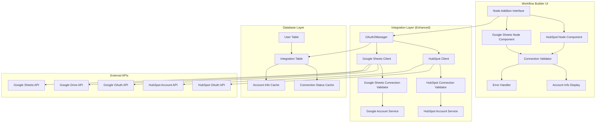

# Design Document: HubSpot and Google Sheets Integration with Connection Validation

## Overview

This design extends the existing integration infrastructure to provide seamless HubSpot and Google Sheets node integration with automatic connection validation and user information retrieval. The solution leverages the existing OAuth2Manager, provider configurations, and client libraries while adding enhanced connection testing, user account information display, and real-time validation feedback.

The design focuses on creating an intuitive workflow node experience where users can:
- Add HubSpot and Google Sheets nodes with immediate connection validation
- View their account information and connection status
- Receive clear feedback on authentication and permission issues
- Access provider-specific configuration options based on their account capabilities

## Architecture

### System Architecture Overview



### Enhanced Integration Architecture

The solution builds upon the existing integration system with these key enhancements:

1. **Connection Validation Service**: Automatic testing when nodes are added
2. **Account Information Service**: Retrieval and display of user account details
3. **Real-time Status Updates**: Live connection status in workflow builder
4. **Enhanced Error Handling**: Provider-specific error messages and recovery guidance

## Components and Interfaces

### 1. Enhanced Node Components

**HubSpot Node Component**
```typescript
interface HubSpotNodeProps {
  nodeId: string;
  onConnectionChange: (status: ConnectionStatus) => void;
  onAccountInfoUpdate: (info: HubSpotAccountInfo) => void;
}

interface HubSpotNodeState {
  connectionStatus: 'validating' | 'connected' | 'disconnected' | 'error';
  accountInfo?: HubSpotAccountInfo;
  availableObjects: HubSpotObject[];
  availableProperties: Record<string, HubSpotProperty[]>;
  error?: string;
}

interface HubSpotAccountInfo {
  portalId: string;
  portalName: string;
  userEmail: string;
  subscriptionTier: string;
  availableObjects: string[];
  permissions: string[];
  apiLimits: {
    dailyLimit: number;
    currentUsage: number;
  };
}
```

**Google Sheets Node Component**
```typescript
interface GoogleSheetsNodeProps {
  nodeId: string;
  onConnectionChange: (status: ConnectionStatus) => void;
  onAccountInfoUpdate: (info: GoogleAccountInfo) => void;
}

interface GoogleSheetsNodeState {
  connectionStatus: 'validating' | 'connected' | 'disconnected' | 'error';
  accountInfo?: GoogleAccountInfo;
  availableSpreadsheets: GoogleSpreadsheet[];
  selectedSpreadsheet?: GoogleSpreadsheet;
  availableSheets: GoogleSheet[];
  error?: string;
}

interface GoogleAccountInfo {
  email: string;
  name: string;
  driveQuota: {
    limit: string;
    usage: string;
    usageInDrive: string;
  };
  permissions: {
    canCreateFiles: boolean;
    canEditFiles: boolean;
    canShareFiles: boolean;
  };
}
```

### 2. Connection Validation Services

**HubSpot Connection Validator**
```typescript
export class HubSpotConnectionValidator {
  constructor(
    private hubspotClient: HubSpotClient,
    private oauth2Manager: OAuth2Manager
  ) {}

  async validateConnection(userId: string): Promise<HubSpotValidationResult> {
    try {
      // 1. Check if integration exists and tokens are valid
      const integration = await this.oauth2Manager.getIntegration(userId, 'hubspot');
      if (!integration) {
        return {
          success: false,
          error: 'No HubSpot integration found',
          requiresAuth: true
        };
      }

      // 2. Test API connection with account info call
      const accountInfo = await this.hubspotClient.getAccountInfo(integration.accessToken);
      
      // 3. Validate permissions and capabilities
      const permissions = await this.hubspotClient.getPermissions(integration.accessToken);
      
      // 4. Get available objects and properties
      const availableObjects = await this.hubspotClient.getAvailableObjects(integration.accessToken);
      
      return {
        success: true,
        accountInfo: {
          portalId: accountInfo.portalId,
          portalName: accountInfo.portalName || `Portal ${accountInfo.portalId}`,
          userEmail: accountInfo.userEmail,
          subscriptionTier: accountInfo.subscriptionTier,
          availableObjects: availableObjects.map(obj => obj.name),
          permissions: permissions,
          apiLimits: accountInfo.apiLimits
        },
        availableObjects,
        lastValidated: new Date()
      };
    } catch (error) {
      return this.handleValidationError(error);
    }
  }

  private handleValidationError(error: any): HubSpotValidationResult {
    if (error.status === 401) {
      return {
        success: false,
        error: 'HubSpot authentication expired',
        requiresAuth: true,
        errorCode: 'AUTH_EXPIRED'
      };
    }
    
    if (error.status === 403) {
      return {
        success: false,
        error: 'Insufficient HubSpot permissions',
        requiresAuth: false,
        errorCode: 'INSUFFICIENT_PERMISSIONS',
        suggestedAction: 'Please ensure your HubSpot user has the necessary permissions for this integration.'
      };
    }

    return {
      success: false,
      error: `HubSpot connection failed: ${error.message}`,
      requiresAuth: false,
      errorCode: 'CONNECTION_FAILED'
    };
  }
}
```

**Google Sheets Connection Validator**
```typescript
export class GoogleSheetsConnectionValidator {
  constructor(
    private googleSheetsClient: GoogleSheetsClient,
    private oauth2Manager: OAuth2Manager
  ) {}

  async validateConnection(userId: string): Promise<GoogleSheetsValidationResult> {
    try {
      // 1. Check if integration exists and tokens are valid
      const integration = await this.oauth2Manager.getIntegration(userId, 'google');
      if (!integration) {
        return {
          success: false,
          error: 'No Google integration found',
          requiresAuth: true
        };
      }

      // 2. Test API connection with user info
      const userInfo = await this.googleSheetsClient.getUserInfo(integration.accessToken);
      
      // 3. Test Drive access and get quota information
      const driveInfo = await this.googleSheetsClient.getDriveInfo(integration.accessToken);
      
      // 4. Test Sheets API access
      const sheetsAccess = await this.googleSheetsClient.testSheetsAccess(integration.accessToken);
      
      return {
        success: true,
        accountInfo: {
          email: userInfo.email,
          name: userInfo.name,
          driveQuota: driveInfo.quota,
          permissions: {
            canCreateFiles: sheetsAccess.canCreate,
            canEditFiles: sheetsAccess.canEdit,
            canShareFiles: sheetsAccess.canShare
          }
        },
        lastValidated: new Date()
      };
    } catch (error) {
      return this.handleValidationError(error);
    }
  }

  private handleValidationError(error: any): GoogleSheetsValidationResult {
    if (error.status === 401) {
      return {
        success: false,
        error: 'Google authentication expired',
        requiresAuth: true,
        errorCode: 'AUTH_EXPIRED'
      };
    }
    
    if (error.status === 403) {
      return {
        success: false,
        error: 'Insufficient Google Drive/Sheets permissions',
        requiresAuth: false,
        errorCode: 'INSUFFICIENT_PERMISSIONS',
        suggestedAction: 'Please ensure you have granted the necessary Google Drive and Sheets permissions.'
      };
    }

    return {
      success: false,
      error: `Google Sheets connection failed: ${error.message}`,
      requiresAuth: false,
      errorCode: 'CONNECTION_FAILED'
    };
  }
}
```

### 3. Enhanced Client Methods

**HubSpot Client Extensions**
```typescript
// Add to existing HubSpotClient class
export class HubSpotClient {
  // ... existing methods

  async getAccountInfo(accessToken: string): Promise<HubSpotAccountDetails> {
    const response = await this.makeRequest('/account-info/v3/details', {
      method: 'GET',
      headers: {
        'Authorization': `Bearer ${accessToken}`,
        'Content-Type': 'application/json'
      }
    });

    return {
      portalId: response.portalId,
      portalName: response.portalName,
      userEmail: response.userEmail,
      subscriptionTier: response.subscriptionTier,
      apiLimits: {
        dailyLimit: response.apiLimits?.dailyLimit || 40000,
        currentUsage: response.apiLimits?.currentUsage || 0
      }
    };
  }

  async getPermissions(accessToken: string): Promise<string[]> {
    const response = await this.makeRequest('/oauth/v1/access-tokens/' + accessToken, {
      method: 'GET',
      headers: {
        'Authorization': `Bearer ${accessToken}`
      }
    });

    return response.scopes || [];
  }

  async getAvailableObjects(accessToken: string): Promise<HubSpotObject[]> {
    const response = await this.makeRequest('/crm/v3/schemas', {
      method: 'GET',
      headers: {
        'Authorization': `Bearer ${accessToken}`
      }
    });

    return response.results.map((schema: any) => ({
      name: schema.name,
      label: schema.labels.singular,
      properties: schema.properties
    }));
  }
}
```

**Google Sheets Client Extensions**
```typescript
// Add to existing GoogleSheetsClient class
export class GoogleSheetsClient {
  // ... existing methods

  async getUserInfo(accessToken: string): Promise<GoogleUserInfo> {
    const response = await fetch('https://www.googleapis.com/oauth2/v2/userinfo', {
      headers: {
        'Authorization': `Bearer ${accessToken}`
      }
    });

    if (!response.ok) {
      throw new Error(`Failed to get user info: ${response.statusText}`);
    }

    return response.json();
  }

  async getDriveInfo(accessToken: string): Promise<GoogleDriveInfo> {
    const response = await fetch('https://www.googleapis.com/drive/v3/about?fields=storageQuota,user', {
      headers: {
        'Authorization': `Bearer ${accessToken}`
      }
    });

    if (!response.ok) {
      throw new Error(`Failed to get drive info: ${response.statusText}`);
    }

    const data = await response.json();
    return {
      quota: {
        limit: data.storageQuota?.limit || 'unlimited',
        usage: data.storageQuota?.usage || '0',
        usageInDrive: data.storageQuota?.usageInDrive || '0'
      }
    };
  }

  async testSheetsAccess(accessToken: string): Promise<GoogleSheetsPermissions> {
    try {
      // Test by attempting to list spreadsheets
      const response = await fetch('https://www.googleapis.com/drive/v3/files?q=mimeType="application/vnd.google-apps.spreadsheet"&pageSize=1', {
        headers: {
          'Authorization': `Bearer ${accessToken}`
        }
      });

      const canRead = response.ok;
      
      // Test create permission by checking scopes (would need to be passed from OAuth)
      // For now, assume if we can read, we can create/edit
      return {
        canCreate: canRead,
        canEdit: canRead,
        canShare: canRead
      };
    } catch (error) {
      return {
        canCreate: false,
        canEdit: false,
        canShare: false
      };
    }
  }
}
```

### 4. Node Integration Hook

```typescript
export function useNodeIntegration(provider: 'hubspot' | 'google', nodeId: string) {
  const [connectionStatus, setConnectionStatus] = useState<ConnectionStatus>('validating');
  const [accountInfo, setAccountInfo] = useState<any>(null);
  const [error, setError] = useState<string | null>(null);
  const [isLoading, setIsLoading] = useState(true);

  const validateConnection = useCallback(async () => {
    setIsLoading(true);
    setError(null);
    
    try {
      const response = await fetch(`/api/integrations/${provider}/validate`, {
        method: 'POST',
        headers: {
          'Content-Type': 'application/json'
        }
      });

      const result = await response.json();

      if (result.success) {
        setConnectionStatus('connected');
        setAccountInfo(result.accountInfo);
      } else {
        setConnectionStatus(result.requiresAuth ? 'disconnected' : 'error');
        setError(result.error);
      }
    } catch (err) {
      setConnectionStatus('error');
      setError('Failed to validate connection');
    } finally {
      setIsLoading(false);
    }
  }, [provider]);

  const initiateAuth = useCallback(async () => {
    try {
      const response = await fetch(`/api/integrations/oauth/authorize`, {
        method: 'POST',
        headers: {
          'Content-Type': 'application/json'
        },
        body: JSON.stringify({ provider })
      });

      const { authUrl } = await response.json();
      window.open(authUrl, '_blank', 'width=600,height=700');
      
      // Listen for auth completion
      const handleMessage = (event: MessageEvent) => {
        if (event.data.type === 'oauth_success' && event.data.provider === provider) {
          window.removeEventListener('message', handleMessage);
          validateConnection();
        }
      };
      
      window.addEventListener('message', handleMessage);
    } catch (err) {
      setError('Failed to initiate authentication');
    }
  }, [provider, validateConnection]);

  useEffect(() => {
    validateConnection();
  }, [validateConnection]);

  return {
    connectionStatus,
    accountInfo,
    error,
    isLoading,
    validateConnection,
    initiateAuth
  };
}
```

## Data Models

### Enhanced Integration Data Structures

```typescript
interface ConnectionStatus {
  status: 'validating' | 'connected' | 'disconnected' | 'error';
  lastValidated?: Date;
  error?: string;
  errorCode?: string;
  requiresAuth?: boolean;
  suggestedAction?: string;
}

interface HubSpotValidationResult {
  success: boolean;
  accountInfo?: HubSpotAccountInfo;
  availableObjects?: HubSpotObject[];
  error?: string;
  errorCode?: string;
  requiresAuth?: boolean;
  suggestedAction?: string;
  lastValidated?: Date;
}

interface GoogleSheetsValidationResult {
  success: boolean;
  accountInfo?: GoogleAccountInfo;
  error?: string;
  errorCode?: string;
  requiresAuth?: boolean;
  suggestedAction?: string;
  lastValidated?: Date;
}

interface HubSpotObject {
  name: string;
  label: string;
  properties: HubSpotProperty[];
}

interface HubSpotProperty {
  name: string;
  label: string;
  type: string;
  fieldType: string;
  options?: Array<{ label: string; value: string }>;
}

interface GoogleSpreadsheet {
  id: string;
  name: string;
  url: string;
  sheets: GoogleSheet[];
}

interface GoogleSheet {
  id: string;
  title: string;
  index: number;
  headers?: string[];
}
```

### Database Schema Extensions

```sql
-- Add connection validation tracking to Integration table
ALTER TABLE "Integration" ADD COLUMN IF NOT EXISTS "lastConnectionValidation" TIMESTAMP;
ALTER TABLE "Integration" ADD COLUMN IF NOT EXISTS "connectionStatus" TEXT DEFAULT 'unknown';
ALTER TABLE "Integration" ADD COLUMN IF NOT EXISTS "accountInfo" JSONB;
ALTER TABLE "Integration" ADD COLUMN IF NOT EXISTS "validationError" TEXT;

-- Create index for efficient connection status queries
CREATE INDEX IF NOT EXISTS "idx_integration_connection_status" 
ON "Integration"("userId", "provider", "connectionStatus");

-- Create table for caching provider-specific data
CREATE TABLE IF NOT EXISTS "IntegrationCache" (
  "id" UUID PRIMARY KEY DEFAULT gen_random_uuid(),
  "integrationId" UUID REFERENCES "Integration"("id") ON DELETE CASCADE,
  "cacheKey" TEXT NOT NULL,
  "cacheData" JSONB NOT NULL,
  "expiresAt" TIMESTAMP NOT NULL,
  "createdAt" TIMESTAMP DEFAULT NOW(),
  UNIQUE("integrationId", "cacheKey")
);

CREATE INDEX IF NOT EXISTS "idx_integration_cache_expiry" 
ON "IntegrationCache"("expiresAt");
```

## Error Handling

### Comprehensive Error Management

```typescript
export enum IntegrationErrorCode {
  // Authentication errors
  AUTH_EXPIRED = 'AUTH_EXPIRED',
  AUTH_INVALID = 'AUTH_INVALID',
  AUTH_REQUIRED = 'AUTH_REQUIRED',
  
  // Permission errors
  INSUFFICIENT_PERMISSIONS = 'INSUFFICIENT_PERMISSIONS',
  SCOPE_MISSING = 'SCOPE_MISSING',
  
  // API errors
  RATE_LIMITED = 'RATE_LIMITED',
  SERVICE_UNAVAILABLE = 'SERVICE_UNAVAILABLE',
  API_ERROR = 'API_ERROR',
  
  // Configuration errors
  INVALID_CONFIG = 'INVALID_CONFIG',
  MISSING_CONFIG = 'MISSING_CONFIG',
  
  // Network errors
  NETWORK_ERROR = 'NETWORK_ERROR',
  TIMEOUT = 'TIMEOUT'
}

export class IntegrationErrorHandler {
  static getErrorMessage(provider: string, errorCode: IntegrationErrorCode): string {
    const messages = {
      hubspot: {
        [IntegrationErrorCode.AUTH_EXPIRED]: 'Your HubSpot authentication has expired. Please reconnect your account.',
        [IntegrationErrorCode.INSUFFICIENT_PERMISSIONS]: 'Your HubSpot account lacks the necessary permissions. Please ensure you have access to the required features.',
        [IntegrationErrorCode.RATE_LIMITED]: 'HubSpot API rate limit reached. Please try again in a few minutes.',
        [IntegrationErrorCode.SERVICE_UNAVAILABLE]: 'HubSpot service is temporarily unavailable. Please try again later.'
      },
      google: {
        [IntegrationErrorCode.AUTH_EXPIRED]: 'Your Google authentication has expired. Please reconnect your account.',
        [IntegrationErrorCode.INSUFFICIENT_PERMISSIONS]: 'Insufficient Google Drive/Sheets permissions. Please ensure you\'ve granted the necessary access.',
        [IntegrationErrorCode.RATE_LIMITED]: 'Google API rate limit reached. Please try again later.',
        [IntegrationErrorCode.SERVICE_UNAVAILABLE]: 'Google Sheets service is temporarily unavailable. Please try again later.'
      }
    };

    return messages[provider]?.[errorCode] || 'An unexpected error occurred. Please try again.';
  }

  static getSuggestedAction(errorCode: IntegrationErrorCode): string {
    const actions = {
      [IntegrationErrorCode.AUTH_EXPIRED]: 'Click the "Reconnect" button to authenticate again.',
      [IntegrationErrorCode.AUTH_REQUIRED]: 'Click the "Connect" button to authenticate with the service.',
      [IntegrationErrorCode.INSUFFICIENT_PERMISSIONS]: 'Check your account permissions and try reconnecting.',
      [IntegrationErrorCode.RATE_LIMITED]: 'Wait a few minutes before trying again.',
      [IntegrationErrorCode.SERVICE_UNAVAILABLE]: 'Check the service status page and try again later.',
      [IntegrationErrorCode.NETWORK_ERROR]: 'Check your internet connection and try again.'
    };

    return actions[errorCode] || 'Please try again or contact support if the issue persists.';
  }
}
```

## Testing Strategy

### 1. Unit Tests

**Connection Validation Tests**
```typescript
describe('HubSpotConnectionValidator', () => {
  it('should successfully validate connection with valid token');
  it('should handle expired token gracefully');
  it('should detect insufficient permissions');
  it('should retrieve account information correctly');
  it('should cache validation results appropriately');
});

describe('GoogleSheetsConnectionValidator', () => {
  it('should successfully validate connection with valid token');
  it('should handle expired token gracefully');
  it('should detect insufficient permissions');
  it('should retrieve user and drive information correctly');
});
```

**Node Component Tests**
```typescript
describe('HubSpotNode', () => {
  it('should display connection status correctly');
  it('should show account information when connected');
  it('should handle authentication flow');
  it('should display appropriate error messages');
  it('should trigger validation on mount');
});

describe('GoogleSheetsNode', () => {
  it('should display connection status correctly');
  it('should show account information when connected');
  it('should handle authentication flow');
  it('should load available spreadsheets');
});
```

### 2. Integration Tests

**End-to-End Connection Flow**
```typescript
describe('Integration Connection Flow', () => {
  it('should complete HubSpot OAuth flow and validate connection');
  it('should complete Google OAuth flow and validate connection');
  it('should handle connection failures gracefully');
  it('should refresh expired tokens automatically');
});
```

### 3. API Tests

**Validation Endpoint Tests**
```typescript
describe('/api/integrations/[provider]/validate', () => {
  it('should validate existing connections');
  it('should return appropriate error for missing integration');
  it('should handle API failures gracefully');
  it('should cache validation results');
});
```

## Security Considerations

### 1. Token Security
- All access tokens stored encrypted in database
- Tokens never exposed in client-side code
- Automatic token refresh with secure storage of refresh tokens
- Token validation before each API call

### 2. API Security
- Rate limiting on validation endpoints
- User authentication required for all integration operations
- Integration ownership validation
- Secure OAuth state parameter handling

### 3. Data Privacy
- Account information cached with appropriate expiry
- Sensitive data excluded from client responses
- Audit logging for integration access
- Compliance with provider data usage policies

## Performance Considerations

### 1. Caching Strategy
- Connection validation results cached for 15 minutes
- Account information cached for 1 hour
- Provider-specific data cached with appropriate TTL
- Cache invalidation on authentication changes

### 2. API Optimization
- Batch requests where possible
- Connection pooling for external API calls
- Retry logic with exponential backoff
- Circuit breaker pattern for failing services

### 3. User Experience
- Immediate feedback during validation
- Progressive loading of account information
- Optimistic UI updates where appropriate
- Background validation refresh

This design provides a comprehensive foundation for implementing HubSpot and Google Sheets integration with automatic connection validation and user information retrieval, building upon the existing infrastructure while maintaining security, performance, and user experience standards.