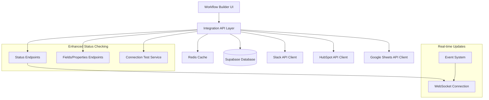

# Design Document

## Overview

This design addresses the integration connection status and field visibility issues in the automation platform. The solution focuses on enhancing existing API endpoints, improving connection testing reliability, and providing comprehensive field/property visibility for connected integrations. The design leverages existing infrastructure while adding robust error handling, caching, and real-time status updates.

## Architecture

### High-Level Architecture



### Component Architecture

The solution extends the existing integration system with enhanced status checking and field retrieval capabilities:

1. **Enhanced Status Endpoints**: Improved connection testing with detailed validation
2. **Field Retrieval Service**: Centralized service for fetching integration-specific fields
3. **Connection Health Monitor**: Real-time monitoring and caching of connection status
4. **Integration Node Enhancer**: UI components showing connection status and available fields

## Components and Interfaces

### 1. Enhanced Connection Testing Service

```typescript
interface ConnectionTestResult {
  success: boolean;
  provider: string;
  connectionDetails?: {
    // Slack-specific
    teamName?: string;
    userName?: string;
    botId?: string;
    scopes?: string[];
    
    // HubSpot-specific
    portalId?: string;
    accountId?: string;
    permissions?: string[];
    
    // Google Sheets-specific
    userEmail?: string;
    driveAccess?: boolean;
    sheetsAccess?: boolean;
  };
  availableFields?: IntegrationField[];
  error?: string;
  lastTested?: string;
  nextRetry?: string;
}

interface IntegrationField {
  id: string;
  name: string;
  label: string;
  type: 'string' | 'number' | 'boolean' | 'date' | 'enum';
  required?: boolean;
  options?: Array<{ label: string; value: string }>;
  description?: string;
  category?: string;
}
```

### 2. Field Retrieval Service

```typescript
interface FieldRetrievalService {
  // Slack fields
  getSlackChannels(integrationId: string): Promise<SlackChannel[]>;
  getSlackUsers(integrationId: string): Promise<SlackUser[]>;
  
  // HubSpot fields
  getHubSpotProperties(integrationId: string, objectType: 'contact' | 'deal' | 'company'): Promise<HubSpotProperty[]>;
  getHubSpotPipelines(integrationId: string): Promise<HubSpotPipeline[]>;
  
  // Google Sheets fields
  getGoogleSpreadsheets(integrationId: string): Promise<GoogleSpreadsheet[]>;
  getGoogleSheets(integrationId: string, spreadsheetId: string): Promise<GoogleSheet[]>;
  getSheetHeaders(integrationId: string, spreadsheetId: string, sheetName: string): Promise<string[]>;
}
```

### 3. Connection Health Monitor

```typescript
interface ConnectionHealthMonitor {
  checkConnectionHealth(integrationId: string): Promise<ConnectionTestResult>;
  scheduleHealthCheck(integrationId: string, intervalMinutes: number): void;
  getCachedStatus(integrationId: string): ConnectionTestResult | null;
  invalidateCache(integrationId: string): void;
  subscribeToStatusUpdates(integrationId: string, callback: (status: ConnectionTestResult) => void): void;
}
```

### 4. Enhanced Integration Nodes

```typescript
interface IntegrationNodeProps {
  integrationId: string;
  provider: 'slack' | 'hubspot' | 'google';
  actionType: string;
  onFieldSelect: (field: IntegrationField) => void;
  onConnectionIssue: (error: string) => void;
}

interface IntegrationNodeState {
  connectionStatus: 'connected' | 'disconnected' | 'testing' | 'error';
  availableFields: IntegrationField[];
  loading: boolean;
  error?: string;
}
```

## Data Models

### Enhanced Integration Status Table

```sql
-- Extend existing Integration table with health monitoring
ALTER TABLE "Integration" ADD COLUMN IF NOT EXISTS "lastHealthCheck" TIMESTAMP;
ALTER TABLE "Integration" ADD COLUMN IF NOT EXISTS "healthStatus" TEXT DEFAULT 'unknown';
ALTER TABLE "Integration" ADD COLUMN IF NOT EXISTS "healthDetails" JSONB;
ALTER TABLE "Integration" ADD COLUMN IF NOT EXISTS "fieldsCacheExpiry" TIMESTAMP;
ALTER TABLE "Integration" ADD COLUMN IF NOT EXISTS "fieldsCache" JSONB;
```

### Integration Fields Cache

```sql
CREATE TABLE IF NOT EXISTS "IntegrationFieldsCache" (
  "id" UUID PRIMARY KEY DEFAULT gen_random_uuid(),
  "integrationId" UUID REFERENCES "Integration"("id") ON DELETE CASCADE,
  "fieldType" TEXT NOT NULL, -- 'channels', 'properties', 'spreadsheets', etc.
  "fields" JSONB NOT NULL,
  "cachedAt" TIMESTAMP DEFAULT NOW(),
  "expiresAt" TIMESTAMP NOT NULL,
  "createdAt" TIMESTAMP DEFAULT NOW(),
  "updatedAt" TIMESTAMP DEFAULT NOW()
);

CREATE INDEX IF NOT EXISTS "idx_integration_fields_cache_integration_type" 
ON "IntegrationFieldsCache"("integrationId", "fieldType");
```

## Error Handling

### 1. Connection Test Error Handling

```typescript
class IntegrationConnectionError extends Error {
  constructor(
    message: string,
    public provider: string,
    public errorCode: string,
    public retryable: boolean = true,
    public retryAfter?: number
  ) {
    super(message);
    this.name = 'IntegrationConnectionError';
  }
}

// Error categories with specific handling
enum ConnectionErrorType {
  AUTHENTICATION_FAILED = 'auth_failed',
  PERMISSION_DENIED = 'permission_denied',
  RATE_LIMITED = 'rate_limited',
  SERVICE_UNAVAILABLE = 'service_unavailable',
  INVALID_CONFIGURATION = 'invalid_config',
  NETWORK_ERROR = 'network_error'
}
```

### 2. Retry Logic with Exponential Backoff

```typescript
interface RetryConfig {
  maxAttempts: number;
  baseDelay: number;
  maxDelay: number;
  backoffMultiplier: number;
  retryableErrors: string[];
}

class ConnectionRetryService {
  async executeWithRetry<T>(
    operation: () => Promise<T>,
    config: RetryConfig
  ): Promise<T> {
    // Implementation with exponential backoff
  }
}
```

### 3. User-Friendly Error Messages

```typescript
const ERROR_MESSAGES = {
  slack: {
    auth_failed: 'Slack authentication has expired. Please reconnect your Slack account.',
    permission_denied: 'The Slack bot doesn\'t have permission to access this resource. Please check bot permissions.',
    rate_limited: 'Slack API rate limit reached. Please try again in a few minutes.',
  },
  hubspot: {
    auth_failed: 'HubSpot authentication has expired. Please reconnect your HubSpot account.',
    permission_denied: 'Your HubSpot account doesn\'t have permission to access this feature. Please check your HubSpot permissions.',
    rate_limited: 'HubSpot API rate limit reached. Please try again later.',
  },
  google: {
    auth_failed: 'Google authentication has expired. Please reconnect your Google account.',
    permission_denied: 'Google Sheets access denied. Please ensure you\'ve granted the necessary permissions.',
    rate_limited: 'Google API rate limit reached. Please try again later.',
  }
};
```

## Testing Strategy

### 1. Unit Tests

- **Connection Test Services**: Test each integration client's connection testing methods
- **Field Retrieval Services**: Test field fetching and caching logic
- **Error Handling**: Test error categorization and retry logic
- **Cache Management**: Test cache invalidation and expiry logic

### 2. Integration Tests

- **End-to-End Connection Testing**: Test complete connection flow for each provider
- **Field Retrieval Integration**: Test field fetching with real API responses
- **Error Scenario Testing**: Test handling of various API error conditions
- **Cache Performance**: Test cache hit/miss scenarios and performance

### 3. UI Component Tests

- **Integration Node Components**: Test connection status display and field selection
- **Error State Handling**: Test error message display and retry functionality
- **Loading States**: Test loading indicators and progressive enhancement
- **Real-time Updates**: Test WebSocket connection status updates

### 4. Performance Tests

- **API Response Times**: Ensure connection tests complete within acceptable timeframes
- **Cache Efficiency**: Test cache hit rates and memory usage
- **Concurrent Requests**: Test handling of multiple simultaneous connection tests
- **Rate Limit Handling**: Test proper handling of API rate limits

## Implementation Phases

### Phase 1: Enhanced Connection Testing
1. Improve existing status endpoints with detailed validation
2. Add comprehensive error handling and retry logic
3. Implement connection result caching
4. Add real-time status update capabilities

### Phase 2: Field Retrieval Enhancement
1. Create field retrieval service for each integration type
2. Implement field caching with appropriate expiry
3. Add field search and filtering capabilities
4. Create unified field interface for UI consumption

### Phase 3: UI Integration
1. Enhance integration nodes with connection status display
2. Add field selection components for each integration type
3. Implement real-time status updates in UI
4. Add connection troubleshooting helpers

### Phase 4: Monitoring and Analytics
1. Add integration health monitoring dashboard
2. Implement connection success/failure metrics
3. Add automated alerting for integration issues
4. Create integration usage analytics

## Security Considerations

### 1. Token Security
- Ensure access tokens are never exposed in client-side code
- Implement secure token refresh mechanisms
- Add token encryption at rest

### 2. API Security
- Validate all integration IDs against user ownership
- Implement rate limiting on integration endpoints
- Add request logging for security monitoring

### 3. Data Privacy
- Ensure field data is only accessible to authorized users
- Implement proper data retention policies for cached fields
- Add audit logging for integration access

## Performance Considerations

### 1. Caching Strategy
- Cache connection test results for 5-15 minutes depending on provider
- Cache field data for 1-24 hours depending on data type
- Implement cache warming for frequently accessed integrations

### 2. API Optimization
- Batch field retrieval requests where possible
- Implement connection pooling for external API calls
- Use compression for large field datasets

### 3. Real-time Updates
- Use WebSocket connections for status updates
- Implement efficient event filtering to reduce unnecessary updates
- Add connection health monitoring to prevent resource leaks