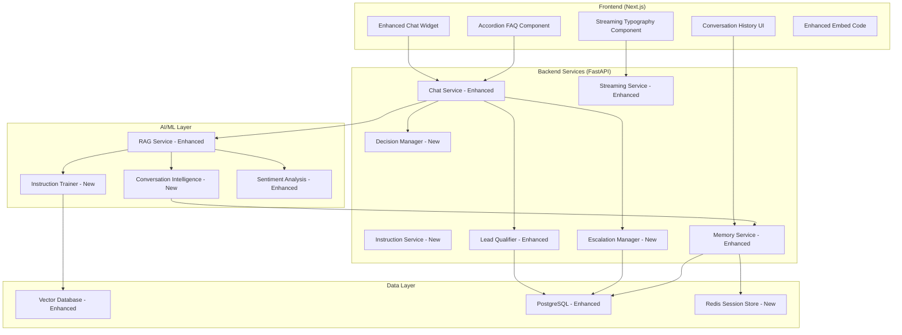

# Design Document

## Overview

This design transforms the existing document-based chatbot into an intelligent conversational AI system with enhanced training capabilities, proactive decision-making, memory awareness, and sophisticated UI features. The solution builds upon the current RAG (Retrieval-Augmented Generation) architecture while adding instruction-based training, conversation intelligence, lead qualification, escalation management, and streaming UI enhancements. The system maintains backward compatibility while introducing advanced conversational capabilities that make the chatbot more helpful, intelligent, and business-focused.

## Architecture

The enhanced architecture extends the existing FastAPI backend and Next.js frontend with new services and components:



## Components and Interfaces

### 1. Enhanced Training Data System

**Purpose**: Extend the current document-based training to include custom instructions and behavioral guidelines.

**Key Components**:

- **InstructionService**: Manages custom training instructions and behavioral prompts
- **Enhanced Vector Storage**: Separate collections for documents and instructions
- **Instruction Trainer**: Processes and embeds custom instructions for retrieval

**Data Models**:
```typescript
interface TrainingInstruction {
  id: string;
  chatbotId: string;
  type: 'behavior' | 'knowledge' | 'tone' | 'escalation';
  title: string;
  content: string;
  priority: number;
  isActive: boolean;
  embedding?: number[];
  createdAt: Date;
  updatedAt: Date;
}

interface EnhancedTrainRequest {
  chatbotId: string;
  documents?: DocumentInput[];
  instructions?: InstructionInput[];
  replaceExisting?: boolean;
  instructionTypes?: string[];
}
```

**API Endpoints**:
- `POST /api/train/instructions` - Add custom instructions
- `PUT /api/train/instructions/{id}` - Update instructions
- `GET /api/train/instructions` - List instructions by chatbot
- `DELETE /api/train/instructions/{id}` - Remove instructions

### 2. Intelligent Decision-Making System

**Purpose**: Enable proactive conversation management and intelligent response generation.

**Key Components**:

- **DecisionManager**: Analyzes conversation context and determines appropriate actions
- **ConversationIntelligence**: Tracks conversation flow and identifies opportunities
- **ProactiveAssistant**: Generates follow-up questions and suggestions

**Decision Engine Logic**:
```python
class DecisionManager:
    async def analyze_conversation_context(self, message: str, history: List[Message]) -> ConversationContext
    async def determine_proactive_actions(self, context: ConversationContext) -> List[ProactiveAction]
    async def generate_intelligent_response(self, context: ConversationContext, rag_response: str) -> EnhancedResponse
    async def should_ask_followup(self, context: ConversationContext) -> bool
    async def generate_followup_questions(self, context: ConversationContext) -> List[str]
```

**Enhanced Response Model**:
```typescript
interface EnhancedChatResponse {
  response: string;
  proactiveQuestions?: string[];
  suggestedTopics?: string[];
  conversationActions?: ConversationAction[];
  intelligenceMetadata: {
    contextUnderstanding: number;
    proactiveScore: number;
    helpfulnessScore: number;
  };
}
```

### 3. Lead Qualification and Data Collection

**Purpose**: Enhance the existing lead analyzer with more sophisticated qualification and natural data collection.

**Enhanced Lead Analyzer**:
```python
class EnhancedLeadAnalyzer:
    async def analyze_conversation_for_leads(self, conversation: ConversationHistory) -> LeadAnalysis
    async def generate_qualification_questions(self, lead_signals: LeadSignals) -> List[QualificationQuestion]
    async def collect_lead_data_naturally(self, message: str, context: ConversationContext) -> LeadData
    async def determine_lead_priority(self, lead_data: LeadData) -> LeadPriority
```

**Lead Data Models**:
```typescript
interface LeadQualificationData {
  contactInfo: {
    email?: string;
    phone?: string;
    name?: string;
    company?: string;
  };
  qualificationData: {
    budget?: string;
    timeline?: string;
    authority?: string;
    need?: string;
  };
  conversationMetrics: {
    engagementScore: number;
    intentStrength: number;
    urgencyLevel: number;
  };
  collectionStrategy: 'direct' | 'conversational' | 'progressive';
}
```

### 4. Conversation Escalation Management

**Purpose**: Implement intelligent escalation detection and management.

**Escalation Manager**:
```python
class EscalationManager:
    async def detect_escalation_triggers(self, message: str, context: ConversationContext) -> EscalationSignals
    async def determine_escalation_type(self, signals: EscalationSignals) -> EscalationType
    async def generate_escalation_response(self, escalation_type: EscalationType) -> EscalationResponse
    async def notify_human_agents(self, escalation: EscalationRequest) -> NotificationResult
```

**Escalation Triggers**:
- Frustration detection (sentiment analysis)
- Complexity threshold exceeded
- Repeated "I don't know" responses
- User explicitly requests human help
- Technical issues beyond chatbot scope
- Complaint or negative feedback

### 5. Memory-Aware Conversational Context

**Purpose**: Enhance the existing conversation service with sophisticated memory management.

**Enhanced Memory Service**:
```python
class EnhancedMemoryService:
    async def maintain_conversation_context(self, conversation_id: str) -> ConversationMemory
    async def summarize_long_conversations(self, messages: List[Message]) -> ConversationSummary
    async def retrieve_relevant_history(self, current_message: str, user_id: str) -> RelevantHistory
    async def update_user_profile(self, user_id: str, conversation_data: ConversationData) -> UserProfile
```

**Memory Models**:
```typescript
interface ConversationMemory {
  shortTermMemory: Message[]; // Recent messages
  longTermMemory: ConversationSummary[]; // Summarized history
  userProfile: UserProfile; // Learned user preferences
  contextualFacts: ContextualFact[]; // Important facts from conversation
  topicHistory: TopicTransition[]; // Topic flow tracking
}

interface UserProfile {
  preferences: Record<string, any>;
  communicationStyle: string;
  technicalLevel: string;
  commonQuestions: string[];
  satisfactionHistory: number[];
}
```

### 6. Enhanced User Interface Components

**Purpose**: Create beautiful, responsive UI components with streaming and enhanced visual design.

**Enhanced Chat Widget**:
```typescript
interface EnhancedChatWidgetProps {
  // Existing props
  apiKey: string;
  settings?: UserSettings;
  chatbotId?: string;
  
  // New enhanced features
  enableIntelligentResponses?: boolean;
  enableProactiveQuestions?: boolean;
  enableLeadCollection?: boolean;
  enableEscalation?: boolean;
  streamingConfig?: StreamingConfig;
  uiEnhancements?: UIEnhancementConfig;
}

interface StreamingConfig {
  enableStreaming: boolean;
  typingSpeed: number;
  showTypingIndicator: boolean;
  enableTokenAnimation: boolean;
}

interface UIEnhancementConfig {
  theme: 'modern' | 'classic' | 'minimal';
  animations: boolean;
  messageFormatting: boolean;
  richTextSupport: boolean;
}
```

**Accordion FAQ Component**:
```typescript
interface AccordionFAQProps {
  faqs: FAQ[];
  searchable?: boolean;
  categorized?: boolean;
  onFAQSelect?: (faq: FAQ) => void;
  theme?: FAQTheme;
}

interface FAQ {
  id: string;
  question: string;
  answer: string;
  category?: string;
  tags?: string[];
  popularity?: number;
  lastUpdated: Date;
}
```

**Streaming Typography Component**:
```typescript
interface StreamingTextProps {
  content: string;
  speed?: number;
  onComplete?: () => void;
  enableCursor?: boolean;
  formatMarkdown?: boolean;
}
```

## Data Models

### Enhanced Database Schema

**Training Instructions Table**:
```sql
CREATE TABLE training_instructions (
  id UUID PRIMARY KEY DEFAULT gen_random_uuid(),
  chatbot_id UUID NOT NULL REFERENCES chatbots(id),
  type VARCHAR(50) NOT NULL,
  title VARCHAR(255) NOT NULL,
  content TEXT NOT NULL,
  priority INTEGER DEFAULT 1,
  is_active BOOLEAN DEFAULT true,
  embedding VECTOR(1536),
  created_at TIMESTAMP DEFAULT NOW(),
  updated_at TIMESTAMP DEFAULT NOW()
);
```

**Conversation Intelligence Table**:
```sql
CREATE TABLE conversation_intelligence (
  id UUID PRIMARY KEY DEFAULT gen_random_uuid(),
  conversation_id UUID NOT NULL,
  user_id UUID NOT NULL,
  chatbot_id UUID NOT NULL,
  intelligence_data JSONB NOT NULL,
  context_understanding FLOAT,
  proactive_score FLOAT,
  helpfulness_score FLOAT,
  created_at TIMESTAMP DEFAULT NOW()
);
```

**Enhanced Lead Data Table**:
```sql
CREATE TABLE enhanced_leads (
  id UUID PRIMARY KEY DEFAULT gen_random_uuid(),
  conversation_id UUID NOT NULL,
  chatbot_id UUID NOT NULL,
  contact_info JSONB,
  qualification_data JSONB,
  conversation_metrics JSONB,
  collection_strategy VARCHAR(50),
  lead_score FLOAT,
  priority VARCHAR(20),
  status VARCHAR(50) DEFAULT 'new',
  created_at TIMESTAMP DEFAULT NOW(),
  updated_at TIMESTAMP DEFAULT NOW()
);
```

**Escalation Tracking Table**:
```sql
CREATE TABLE escalation_requests (
  id UUID PRIMARY KEY DEFAULT gen_random_uuid(),
  conversation_id UUID NOT NULL,
  chatbot_id UUID NOT NULL,
  escalation_type VARCHAR(50) NOT NULL,
  trigger_reason TEXT,
  escalation_data JSONB,
  status VARCHAR(50) DEFAULT 'pending',
  assigned_agent_id UUID,
  resolved_at TIMESTAMP,
  created_at TIMESTAMP DEFAULT NOW()
);
```

## Error Handling

### Graceful Degradation Strategy

1. **Instruction Service Failure**: Fall back to document-only RAG
2. **Decision Manager Failure**: Provide standard responses without proactive features
3. **Lead Analyzer Failure**: Continue conversation without lead collection
4. **Escalation Manager Failure**: Provide manual escalation options
5. **Memory Service Failure**: Use session-only memory
6. **Streaming Failure**: Fall back to complete response delivery

### Error Recovery Mechanisms

```python
class ErrorRecoveryManager:
    async def handle_service_failure(self, service: str, error: Exception) -> RecoveryAction
    async def implement_fallback_strategy(self, failed_service: str) -> FallbackResult
    async def monitor_service_health(self) -> HealthStatus
    async def auto_recover_services(self) -> RecoveryResult
```

## Testing Strategy

### Unit Testing
- Individual service components
- Data model validation
- API endpoint functionality
- UI component behavior

### Integration Testing
- End-to-end conversation flows
- Service interaction testing
- Database integration testing
- Streaming functionality testing

### Performance Testing
- Response time optimization
- Streaming performance
- Memory usage monitoring
- Concurrent user handling

### User Experience Testing
- Conversation flow testing
- UI responsiveness testing
- Accessibility compliance
- Cross-browser compatibility

## Security Considerations

### Data Protection
- Encrypt sensitive lead data
- Implement conversation data retention policies
- Secure API key management
- User consent management for data collection

### Privacy Compliance
- GDPR compliance for EU users
- CCPA compliance for California users
- Data anonymization options
- Right to deletion implementation

### Access Control
- Role-based access to escalation features
- Secure agent authentication
- Conversation data access controls
- API rate limiting and abuse prevention

## Performance Optimization

### Caching Strategy
- Instruction embedding caching
- Conversation context caching
- FAQ response caching
- User profile caching

### Database Optimization
- Proper indexing for conversation queries
- Vector similarity search optimization
- Connection pooling
- Query optimization for complex joins

### Streaming Optimization
- Efficient token streaming
- Connection management
- Buffer optimization
- Network resilience

## Deployment Considerations

### Infrastructure Requirements
- Enhanced Redis for session management
- Increased database storage for new tables
- Additional compute resources for AI services
- CDN optimization for streaming responses

### Monitoring and Observability
- Conversation intelligence metrics
- Lead conversion tracking
- Escalation success rates
- User satisfaction monitoring
- Performance metrics dashboard

### Rollout Strategy
- Feature flag implementation
- Gradual rollout to existing chatbots
- A/B testing for new features
- Rollback procedures for issues