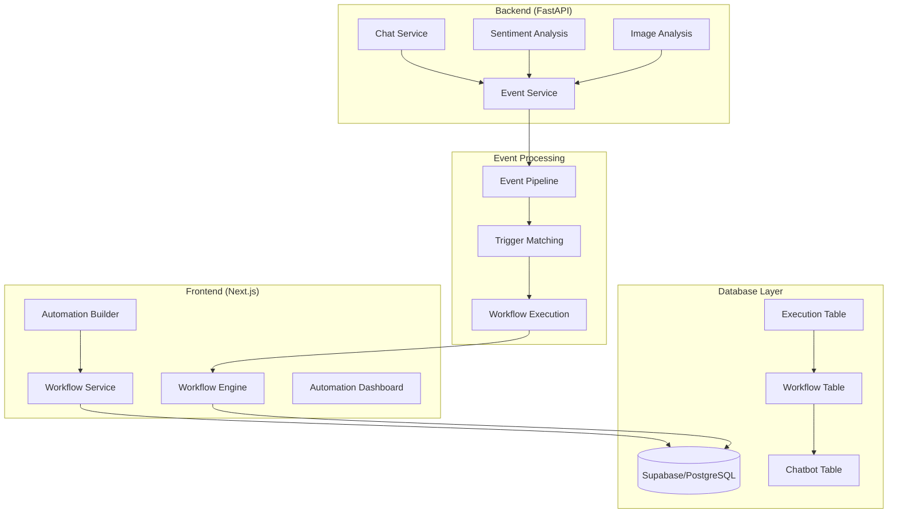

# Design Document

## Overview

This design addresses the critical integration gaps in the EchoAI automation platform by implementing proper database persistence, chatbot-scoped workflows, complete event processing pipeline, and full-stack integration between the FastAPI backend and Next.js frontend. The solution will transform the current in-memory workflow storage into a robust, production-ready system with real-time event processing and proper workflow execution.

## Architecture

### High-Level Architecture



### Component Integration Flow

1. **Event Generation**: FastAPI services emit events via EventService
2. **Event Processing**: Frontend receives events and matches against workflow triggers
3. **Workflow Execution**: Matched workflows execute through WorkflowExecutionEngine
4. **Database Persistence**: All operations persist to Supabase with proper relationships
5. **Real-time Updates**: UI reflects execution status and results in real-time

## Components and Interfaces

### 1. Enhanced Workflow Service

**Purpose**: Replace in-memory storage with Supabase persistence and add chatbot scoping

**Key Changes**:
- Replace Map-based storage with Supabase client operations
- Add chatbotId as required field for all workflow operations
- Implement proper error handling and transaction management
- Add workflow filtering by chatbot context

**Interface Updates**:
```typescript
interface CreateWorkflowRequest {
  name: string;
  description?: string;
  flowDefinition: ReactFlowDefinition;
  userId: string;
  chatbotId: string; // NEW: Required chatbot association
  isActive?: boolean;
}

interface WorkflowListOptions {
  userId?: string;
  chatbotId?: string; // NEW: Filter by chatbot
  isActive?: boolean;
  limit?: number;
  offset?: number;
}
```

### 2. Event Processing Pipeline

**Purpose**: Connect FastAPI event emission to frontend workflow execution

**Components**:
- **EventBridge**: Handles communication between backend and frontend
- **TriggerMatcher**: Evaluates events against workflow triggers
- **ExecutionCoordinator**: Manages workflow execution lifecycle

**Event Flow**:
```typescript
interface EventProcessingPipeline {
  // Receive events from FastAPI
  receiveEvent(event: TriggerEvent): Promise<void>;
  
  // Match events to workflows
  matchTriggers(event: TriggerEvent, chatbotId: string): Promise<AutomationWorkflow[]>;
  
  // Execute matched workflows
  executeWorkflows(workflows: AutomationWorkflow[], event: TriggerEvent): Promise<ExecutionResult[]>;
}
```

### 3. Database Schema Extensions

**Purpose**: Support workflow persistence with proper relationships

**New Fields in AutomationWorkflow**:
```sql
ALTER TABLE "AutomationWorkflow" ADD COLUMN "chatbotId" TEXT NOT NULL;
ALTER TABLE "AutomationWorkflow" ADD CONSTRAINT "AutomationWorkflow_chatbotId_fkey" 
  FOREIGN KEY ("chatbotId") REFERENCES "Chatbot"("id") ON DELETE CASCADE;
```

**Indexes for Performance**:
```sql
CREATE INDEX "AutomationWorkflow_chatbotId_idx" ON "AutomationWorkflow"("chatbotId");
CREATE INDEX "AutomationWorkflow_userId_chatbotId_idx" ON "AutomationWorkflow"("userId", "chatbotId");
```

### 4. Event Service Integration

**Purpose**: Bridge FastAPI event emission with frontend workflow processing

**Backend Integration Points**:
- Chat message processing
- Sentiment analysis completion
- Image analysis completion
- Conversation lifecycle events

**Frontend Integration Points**:
- Event reception and queuing
- Trigger evaluation
- Workflow execution initiation
- Result logging and UI updates

## Data Models

### Enhanced Workflow Model

```typescript
interface AutomationWorkflow {
  id: string;
  userId: string;
  chatbotId: string; // NEW: Required chatbot association
  name: string;
  description?: string;
  flowDefinition: ReactFlowDefinition;
  stateMachine: XStateDefinition;
  isActive: boolean;
  createdAt: Date;
  updatedAt: Date;
}
```

### Event Processing Models

```typescript
interface TriggerEvent {
  type: string;
  data: Record<string, unknown>;
  conversationId?: string;
  messageId?: string;
  userId: string;
  chatbotId?: string; // NEW: Chatbot context for scoping
  timestamp: Date;
}

interface ExecutionContext {
  workflowId: string;
  chatbotId: string;
  userId: string;
  triggerEvent: TriggerEvent;
  variables: Record<string, unknown>;
}
```

### Database Persistence Models

```typescript
interface WorkflowExecutionRecord {
  id: string;
  workflowId: string;
  chatbotId: string; // NEW: For filtering and analytics
  triggerId: string;
  triggerData: Json;
  status: ExecutionStatus;
  executionLog: Json;
  startedAt: Date;
  completedAt?: Date;
  error?: string;
}
```

## Error Handling

### Database Operation Errors

**Strategy**: Implement comprehensive error handling with proper user feedback

**Error Categories**:
1. **Connection Errors**: Database unavailable, timeout issues
2. **Validation Errors**: Invalid workflow definitions, missing required fields
3. **Constraint Errors**: Foreign key violations, unique constraint failures
4. **Permission Errors**: User access violations, chatbot ownership issues

**Implementation**:
```typescript
class WorkflowServiceError extends Error {
  constructor(
    message: string,
    public code: string,
    public details?: Record<string, unknown>
  ) {
    super(message);
  }
}

// Usage examples
throw new WorkflowServiceError(
  'Chatbot not found or access denied',
  'CHATBOT_ACCESS_DENIED',
  { chatbotId, userId }
);
```

### Event Processing Errors

**Strategy**: Implement retry logic with exponential backoff and dead letter queuing

**Error Scenarios**:
1. **Trigger Evaluation Failures**: Invalid trigger configurations
2. **Workflow Execution Failures**: Action execution errors, timeout issues
3. **Integration Failures**: Third-party service unavailability
4. **Database Write Failures**: Execution log persistence issues

### Workflow Execution Errors

**Strategy**: Implement per-action retry with different strategies based on error type

**Retry Policies**:
- **Transient Errors**: Exponential backoff, max 3 retries
- **Configuration Errors**: No retry, immediate failure
- **Rate Limit Errors**: Linear backoff with jitter
- **Authentication Errors**: Single retry after token refresh

## Testing Strategy

### Unit Testing

**Workflow Service Tests**:
- Database CRUD operations with mocked Supabase client
- Chatbot scoping and access control validation
- Error handling for various failure scenarios
- Workflow compilation and validation

**Event Processing Tests**:
- Event matching against workflow triggers
- Execution coordination and result handling
- Error propagation and retry logic
- Performance under high event volume

### Integration Testing

**Database Integration**:
- End-to-end workflow lifecycle with real database
- Transaction handling and rollback scenarios
- Concurrent access and race condition handling
- Migration and schema evolution testing

**Event Pipeline Integration**:
- FastAPI to frontend event flow
- Real-time processing and latency measurement
- Error recovery and system resilience
- Load testing with multiple concurrent workflows

### End-to-End Testing

**User Workflow Tests**:
- Complete automation creation and execution flow
- Multi-chatbot isolation and scoping
- Real integration with external services
- Performance and scalability validation

**System Integration Tests**:
- Cross-service communication reliability
- Database consistency under load
- Event processing accuracy and completeness
- Error handling and recovery procedures

## Implementation Phases

### Phase 1: Database Integration (Priority: Critical)

**Scope**: Replace in-memory storage with Supabase persistence
- Update WorkflowService to use Supabase client
- Add chatbotId field and foreign key relationships
- Implement proper error handling and validation
- Create database migration scripts

**Deliverables**:
- Updated workflow-service.ts with Supabase integration
- Database schema migration
- Unit tests for database operations
- Error handling implementation

### Phase 2: Event Pipeline Integration (Priority: High)

**Scope**: Connect FastAPI events to frontend workflow execution
- Implement event reception mechanism in frontend
- Create trigger matching and workflow execution coordination
- Integrate with existing WorkflowExecutionEngine
- Add execution logging and monitoring

**Deliverables**:
- Event processing pipeline implementation
- Integration with FastAPI EventService
- Workflow execution coordination
- Real-time execution monitoring

### Phase 3: Chatbot Scoping (Priority: High)

**Scope**: Implement proper workflow isolation by chatbot
- Update all workflow operations to include chatbot context
- Implement access control and validation
- Update UI to show chatbot-specific workflows
- Add workflow copying between chatbots

**Deliverables**:
- Chatbot-scoped workflow management
- Updated automation dashboard UI
- Access control implementation
- Workflow migration utilities

### Phase 4: Production Optimization (Priority: Medium)

**Scope**: Performance, monitoring, and production readiness
- Implement comprehensive logging and metrics
- Add performance monitoring and alerting
- Optimize database queries and indexing
- Implement proper caching strategies

**Deliverables**:
- Production monitoring and alerting
- Performance optimization
- Comprehensive documentation
- Deployment and scaling guidelines

## Security Considerations

### Access Control

**Workflow Access**: Users can only access workflows for chatbots they own
**Execution Permissions**: Workflows can only execute for their associated chatbot
**Data Isolation**: Strict separation of data between different users and chatbots

### Data Protection

**Sensitive Data**: Encrypt integration tokens and sensitive configuration
**Audit Logging**: Track all workflow modifications and executions
**Input Validation**: Sanitize all user inputs and workflow configurations

### Integration Security

**API Keys**: Secure storage and rotation of third-party integration credentials
**Network Security**: Use HTTPS for all external communications
**Rate Limiting**: Implement proper rate limiting for workflow executions

## Performance Considerations

### Database Performance

**Query Optimization**: Use proper indexes for chatbot and user filtering
**Connection Pooling**: Implement efficient database connection management
**Caching Strategy**: Cache frequently accessed workflows and configurations

### Event Processing Performance

**Async Processing**: Use non-blocking event processing with proper queuing
**Batch Operations**: Group related database operations for efficiency
**Resource Management**: Implement proper memory and CPU usage monitoring

### Scalability Planning

**Horizontal Scaling**: Design for multi-instance deployment
**Load Balancing**: Distribute workflow executions across available resources
**Database Scaling**: Plan for read replicas and sharding strategies